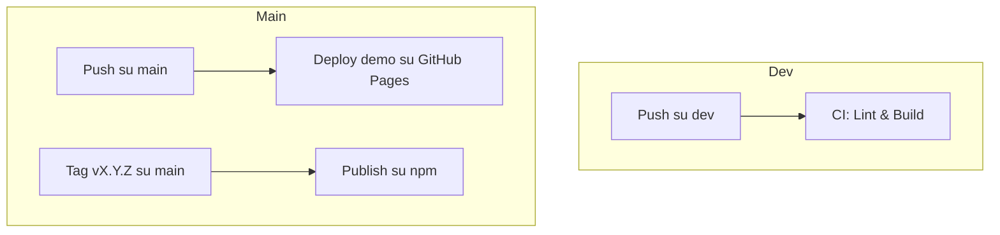

# Note Interne di Progetto

Questo documento raccoglie decisioni di progettazione, convenzioni, workflow di automazione e altre informazioni utili solo per lo sviluppo e la manutenzione interna della libreria di diagrammi per chitarra.

---

## Decisioni di Progettazione

### Struttura del Progetto
- `src/components/ChordDiagram`: Contiene il componente principale per la visualizzazione degli accordi
- `src/types.ts`: Tutte le definizioni TypeScript per i tipi pubblici sono raccolte in questo file unico
- `src/utils`: Funzioni di utilità e helper
- `src/index.ts`: Punto di ingresso principale della libreria

### Convenzioni API
1. **Numerazione delle Corde (String Numbering):**
   - Tutti i tipi relativi alle posizioni (es. `FretPosition`, `NotePosition`, ecc.) sono definiti in `src/types.ts`.
   - La convenzione di numerazione delle corde è rispettata sia nei tipi che nei componenti.
   - La **Corda 1** (`string: 1` in `NotePosition`) si riferisce alla corda con il pitch più alto (es. Mi cantino / High E su una chitarra standard). Nel diagramma, questa corda è visualizzata come la più **a destra**.
   - La **Corda N** (dove N è il numero totale di corde, es. `string: 6` per una chitarra standard) si riferisce alla corda con il pitch più basso (es. Mi basso / Low E). Nel diagramma, questa corda è visualizzata come la più **a sinistra**.
   - Le etichette testuali delle corde (se mostrate) seguono questa convenzione visiva (da sinistra a destra: Low E, A, D, G, B, High E per una chitarra standard).
   - Questa convenzione si applica a `FretPosition.string` e `Barre.fromString/toString`.

2. **Gestione dei Tasti (v2):**
   - `FretPosition.fret`: Rappresenta sempre il numero **assoluto** del tasto sul manico. `0` indica una corda a vuoto. `-1` indica una corda muta o non suonata, che sarà marcata con 'X' nel diagramma.

---

## Workflow di Automazione e Best Practice

Questa sezione descrive il flusso di lavoro raccomandato per lo sviluppo, la verifica e la manutenzione della libreria.

### Flusso Base

1. **Controllo Tipi TypeScript**
   - Comando: `npx tsc --noEmit`
   - Verifica che non ci siano errori di typing.

2. **Linting**
   - Comando: `npm run lint`
   - Il codice deve essere privo di errori e warning (eccetto il warning sulla versione di TypeScript se necessario).

3. **Avvio Ambiente di Sviluppo**
   - Comando: `npm run dev`
   - L’app deve partire senza errori di runtime.

4. **Gestione delle Dipendenze Typings**
   - Assicurarsi che `@types/react` e `@types/react-dom` siano allineate alla versione di React usata.
   - Aggiornare i typings se si aggiorna React.

---

### Branch di riferimento e flusso git

- **Branch principale di sviluppo:**
  - Tutte le nuove feature, fix e refactor dovrebbero essere sviluppati su branch separati a partire da `main` (o `develop` se presente).
  - Esempi di naming: `feature/nuova-funzionalita`, `fix/bug-xyz`, `chore/aggiorna-typing`.

- **Flusso raccomandato:**
  1. Crea un nuovo branch dalla base aggiornata di `main` (o `develop`).
  2. Segui il workflow di automazione (typing, lint, dev) sul branch di lavoro.
  3. Prima del merge su `main`, assicurati che tutti i check siano verdi.
  4. I merge su `main` dovrebbero essere fatti solo tramite Pull Request (se usi una piattaforma come GitHub/GitLab).
  5. Per rilasci o versioni pubbliche, usa tag o branch dedicati (es. `release/v1.0.0`).

- **Nota:**
  - Se lavori da solo puoi anche lavorare direttamente su `main`, ma è comunque consigliato usare branch separati per mantenere la cronologia pulita e facilitare eventuali rollback.

#### Esempio pratico

```sh
git checkout main
git pull
git checkout -b feature/nuova-funzionalita

# ... sviluppo ...

npx tsc --noEmit
npm run lint
npm run dev

git add .
git commit -m "Implementa nuova funzionalità"
git push origin feature/nuova-funzionalita

# Apri una Pull Request verso main
```

---

5. **Documentazione Interna**
   - Tutte le note di workflow, workaround, checklist, ecc. vanno inserite in questo file o in altri file della cartella privata (`/private`), che è esclusa dal repository pubblico tramite `.gitignore`.

---

## Workflow GitHub Actions

Nel progetto sono presenti tre workflow principali automatizzati tramite GitHub Actions:

### 1. CI su branch `dev` (`ci-dev.yml`)
- **Trigger:** Ogni push su `dev`
- **Step:** Lint, build
- **Obiettivo:** Garantire che il codice di sviluppo sia sempre buildabile e conforme agli standard.

### 2. Deploy demo su `main` (`deploy-demo.yml`)
- **Trigger:** Ogni push su `main`
- **Step:** Build della demo (in `examples/react-test-app`), deploy automatico su GitHub Pages.
- **Obiettivo:** Aggiornare la demo pubblica ogni volta che il branch principale viene aggiornato.

### 3. Pubblicazione su npm (`publish.yml`)
- **Trigger:** Push di un tag versione `v*.*.*` (es: `v1.0.0`)
- **Step:** Build e pubblicazione automatica su npm.
- **Obiettivo:** Automatizzare la pubblicazione della libreria su npm.

---

### Schema visuale dei flussi



---

### Esempio pratico di rilascio

```sh
# Dopo aver completato e testato su dev:
git checkout main
git merge dev
git push
# (Deploy demo parte in automatico)

# Per pubblicare su npm:
git tag v1.2.0
git push origin v1.2.0
# (Parte workflow publish.yml)
```

---

### Note
- Questo file è destinato solo agli sviluppatori e non va incluso nella distribuzione pubblica della libreria.
- Per informazioni pubbliche, usare solo il `README.md` nella root del progetto.
